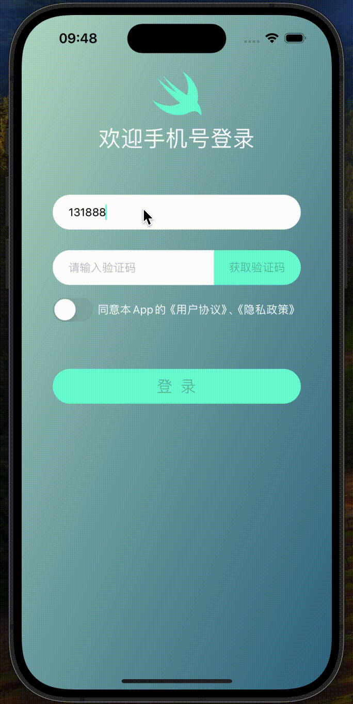

一个Combine Demo。
Combine是苹果发布的响应式框架，iOS13一起发布的，所以最低iOS13才能使用。

做了一个简单登录界面的异步处理演示。

## 页面逻辑说明：

1. 获取验证码按钮是否启用（isEnabled）跟手机号输入框值是否有效有关。输入11位长度字符串获取验证码按钮isEnabled变为true。

2. 登录按钮是否启用（isEnabled）跟三个控件状态或值相关联，分别是：手机号输入框内容、验证码输入框内容以及同意隐私政策开关。三个控件同时满足校验才能改登录按钮isEnabled位true。
